My robotics competition journey spanning three years, from RoboCup to information security contests.

<!-- 插图片：图片放到 images/ 文件夹 -->
<!--  -->
---

## 2024

### August — Hangzhou — RoboCup China (Qualifier)
Participated in the RoboCup China competition qualifier round in Hangzhou.

第一年，我没有参加睿抗的比赛，所以没有去，附一张队友在杭州的比赛照片~ ~~谢老板每年去杭州比赛都要找女朋友~~

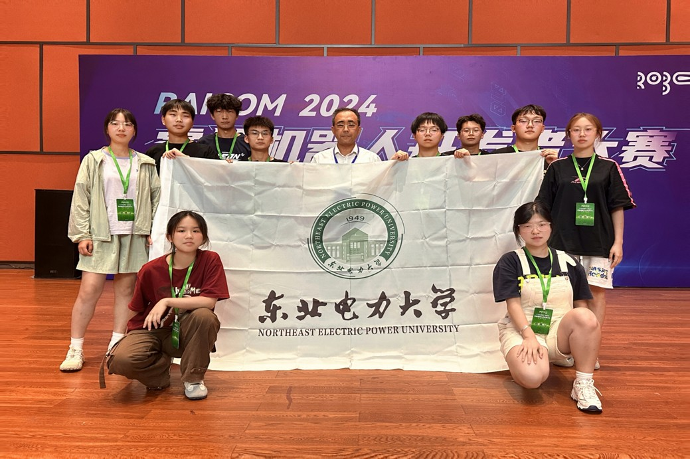
     
洛阳理工大学参赛大牌子

### August — Luoyang — RoboCup China (Qualifier)  
Competed in another qualifier event in Luoyang.

**地点：洛阳理工大学**  

名义上是我第一次参加的比赛，所以对待的格外认真，我比的项目是舞蹈机器人，赛场是有空调感觉很舒服，但是楼下的赛场（农业机器人）没有，还是很辛苦的。最终取得的成绩还可以，~~洛阳真的太热了~~

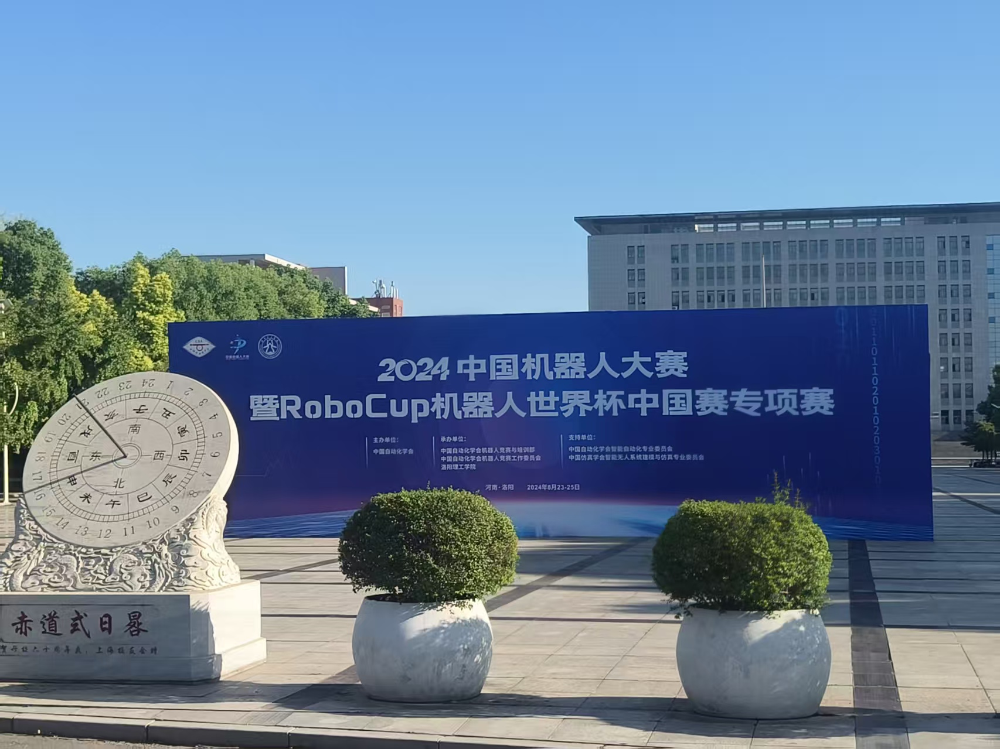
     
洛阳理工大学参赛大牌子

### October — Xi'an — RoboCup China Finals
Reached the national finals in Xi'an. An intense and rewarding experience.

**地点：西安奥体中心**  

参赛的学校与队伍很多，大家都很有热情，感受到青春的氛围，共同进步。最后比赛的结果也是意料之中。

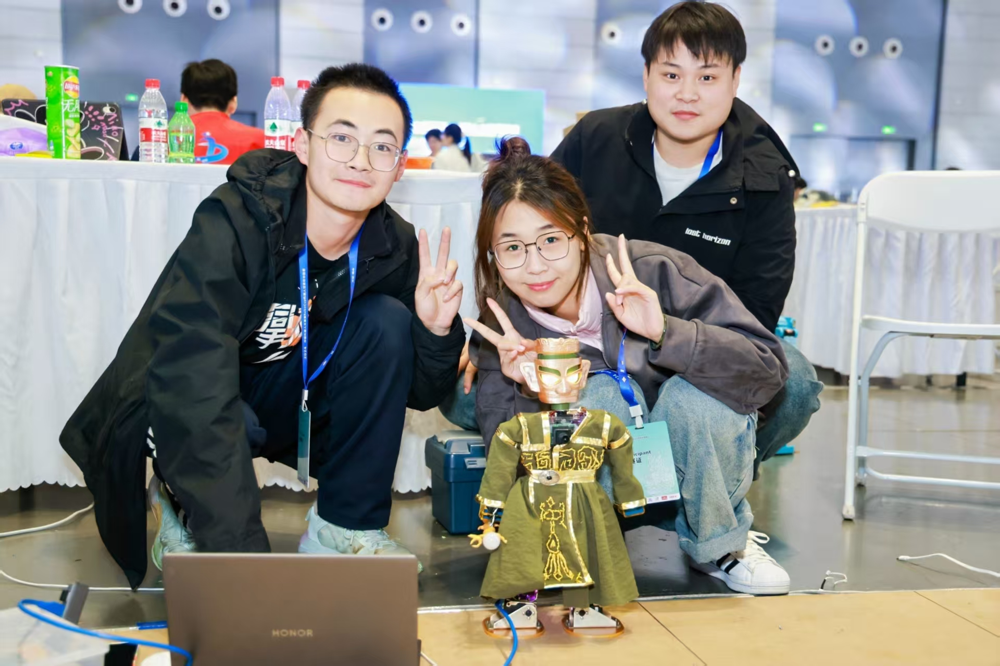
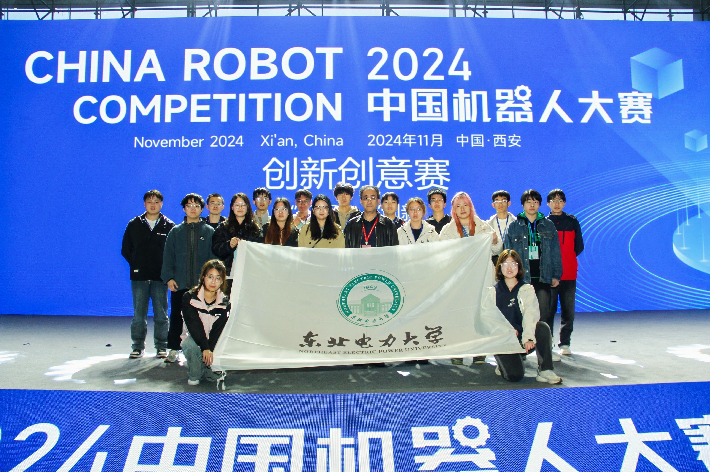
     
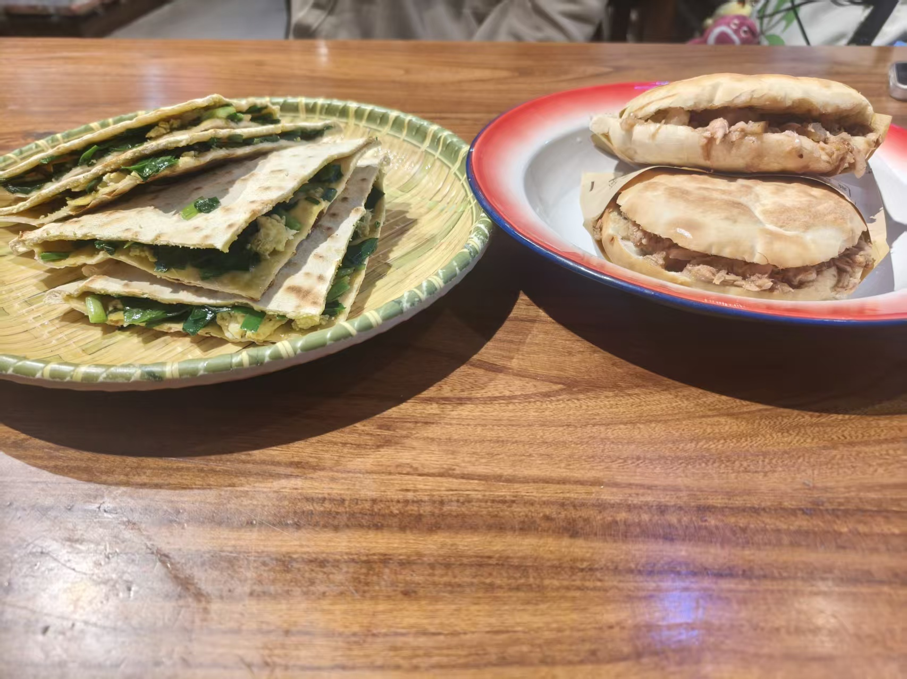
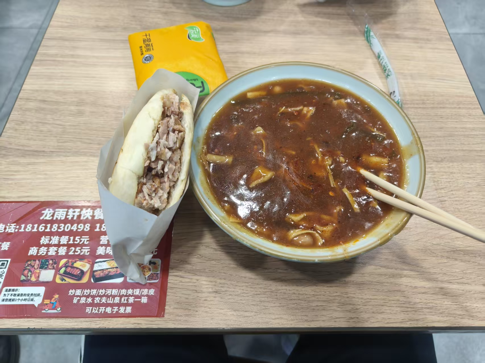
     
比赛现场以及西安碳水美食~

### December — Xiamen — Information Security & Countermeasure Competition
Switched gears to compete in information security in Xiamen.

**地点：厦门理工大学**  

有点忘记是不是在这个地方比赛的了，但是厦门的美食是真的好吃，而且厦门的沙滩也很美。比赛早早的结束了，玩的时间也比较长，去了集美学村、十里长堤等，队友去了鼓浪屿，~~谢老板又回家找对象了~~，我漳州见高中同学了，由于是12月，厦门天气也不是很热，很舒服，以至于回来之后在吉林也有很长的戒断反应。

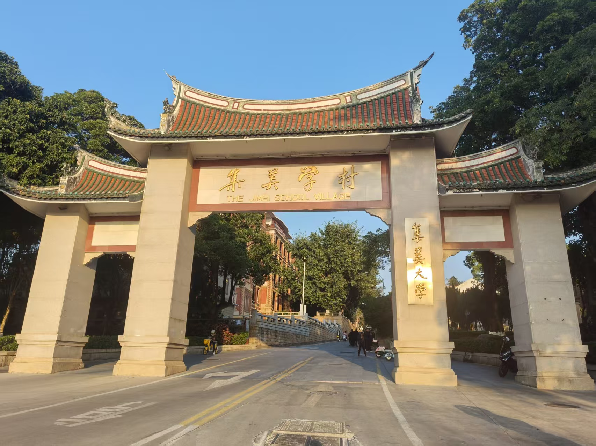
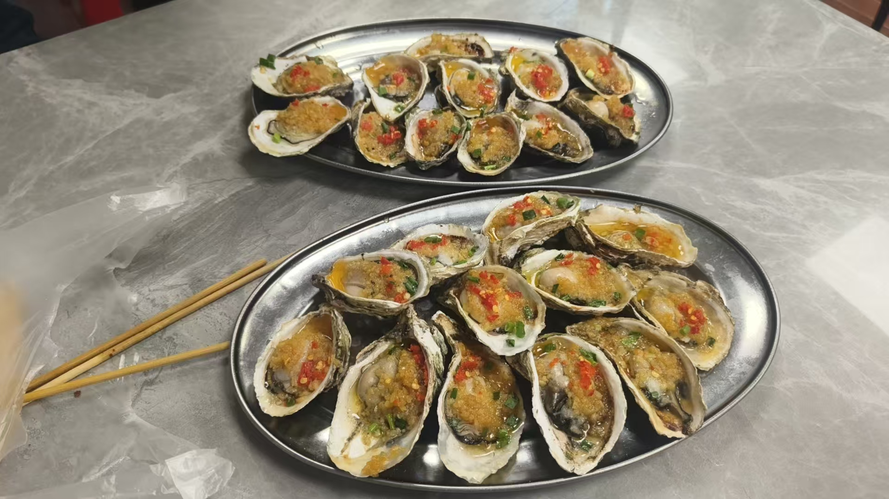
     
集美学村以及张老师力推的烤生蚝

## 2025

### August — Yantai — RoboCup China (Qualifier)
Back for another season of RoboCup competition.

**地点：哈尔滨工程大学（烟台校区）**

由于新赛季改了规则，备赛期间以及比赛期间一直在改代码改算法。烟台我算是没少去了，经常去烟台找刘同学(在烟台上学).比赛期间也是一直在调车加逻辑，四六级出分的那天是早上六点，我和谢老板还没睡，我们把团队成员的四六级成绩查了个遍，~~几家欢喜几家愁~~。这次研究生宏哥和峥哥也因为暑假留校跟我们来参加比赛了，为我们保证了坚实的后勤保障，赞！

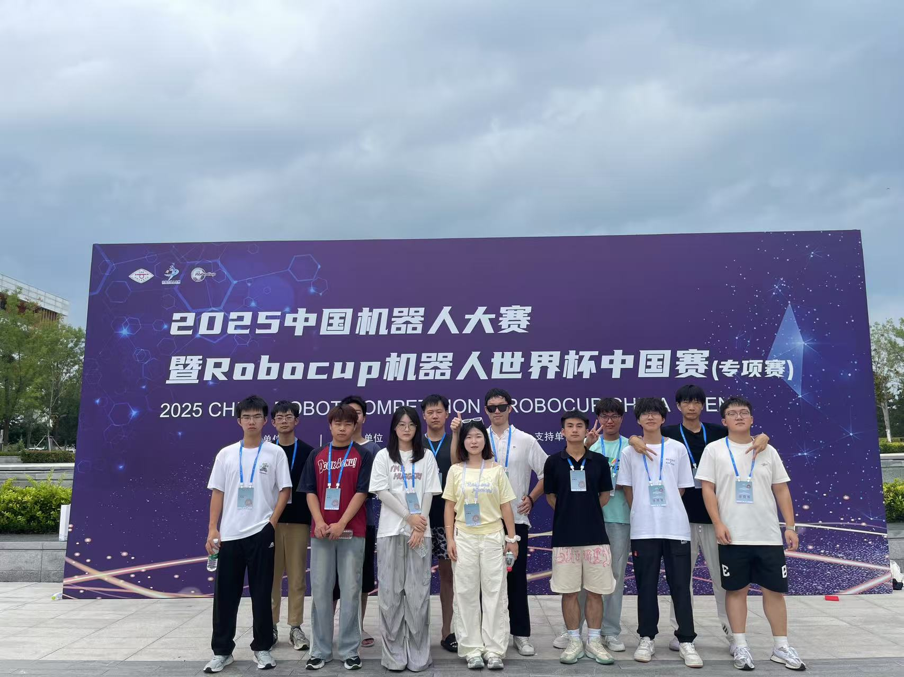
     
没有我的合影

### August — Hangzhou — Ruirang Robot Developer Contest
Took on a new challenge at the robot developer contest in Hangzhou.

**地点：余杭区 人工智能小镇**

吸取了在烟台比赛的经验进行了修正，比赛结果也还可以，但是杭州的天气真的热，杭州的夏天真的热。在西湖边上玩了一下，水都是热的。(PS:作者头像就是在西湖拍的)不过也感受到杭州对创业的包容，以及杭州人在休闲时刻的松驰感。

### October — Shijiazhuang — RoboCup China Finals
Second year reaching the national finals.

由于学业原因，石家庄本人没有去，只是提供了线上答疑的服务。此时参赛重心也慢慢的移交给了学弟学妹们(2024级)，附图是比赛现场。

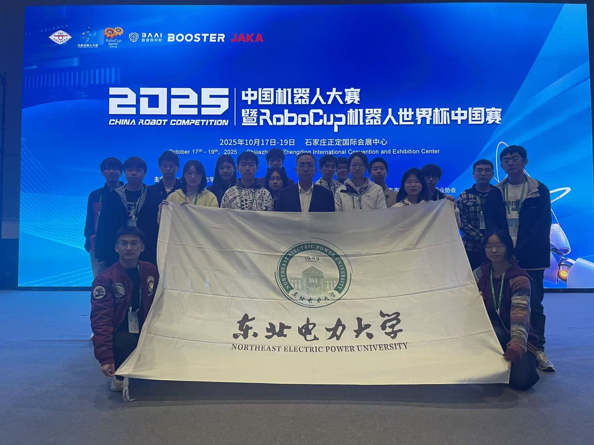
     
2023级与2024级同学合影

### December — Kunming — Information Security & Countermeasure Competition
Closed out the year with another security competition in Kunming.

**地点：昆明理工大学**

由于学业问题，以及昆明实在太远了，并且团队中有同学保研/求职需要这个奖，名额有限，所以没有去昆明，附一张比赛现场的照片。希望未来有机会去云南旅游/出差/交流。

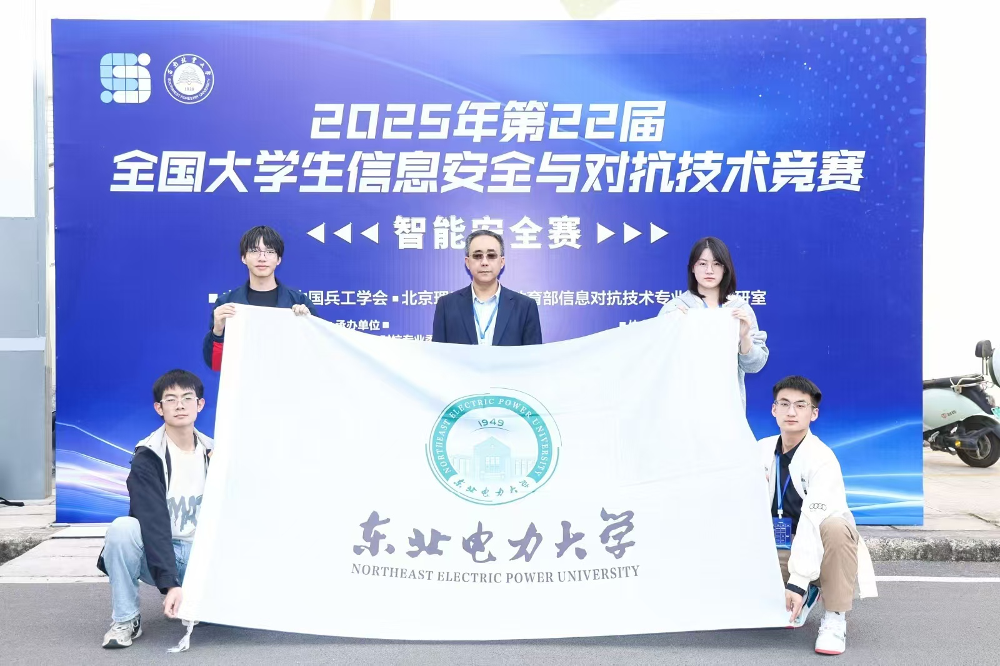
     
昆明理工大学参赛大牌子

至此我的机器人竞赛生涯就结束了，祝愿学弟学妹们取得更好的成绩。
---

  <a href="/works/" class="btn btn--deep-blue-outline">View My Works →</a>

